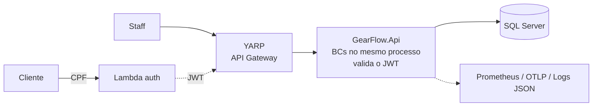

# GearFlow — Aplicação principal

Plataforma de gestão de **oficina mecânica**: clientes/veículos, catálogo de serviços, estoque de
peças/insumos e o ciclo de vida da **Ordem de Serviço** — do recebimento à entrega.

Este é o repositório da **aplicação principal** (repo #4 da Fase 3 do Tech Challenge), reorganizado
de Clean Architecture em camadas para **Bounded Contexts** (monólito modular).

> **Documentação**: comece por [`docs/INDEX.md`](docs/INDEX.md). Arquitetura em
> [ADR-001](docs/architecture/adr-001-modular-monolith-bounded-contexts.md); revisão dos BCs em
> [BOUNDED_CONTEXTS](docs/architecture/BOUNDED_CONTEXTS.md); diagramas (componentes + sequência +
> estados) em [ARCHITECTURE_DIAGRAMS](docs/architecture/ARCHITECTURE_DIAGRAMS.md). Veja a
> [checklist de entrega da Fase 3](#arquitetura--documentação-fase-3) abaixo.

## Tecnologias

- ASP.NET Core 10 / .NET 10, EF Core 10, **SQL Server**
- MediatR (CQRS), FluentValidation, `Result<T>` → ProblemDetails (RFC 9457)
- Serilog (JSON), OpenTelemetry (Prometheus `/metrics` + OTLP), Health Checks
- YARP (API Gateway), xUnit + FluentAssertions + Testcontainers + NetArchTest

## Arquitetura (resumo)

Monólito modular: cada capacidade é um **Bounded Context** (`Domain/Application/Infrastructure`);
um único host (`GearFlow.Api`) expõe os endpoints; um Gateway fica à frente. Bounded Contexts:
**Identity, Customers, Catalog, Inventory, Workshop (core), Notifications**. Detalhe no
[ADR-001](docs/architecture/adr-001-modular-monolith-bounded-contexts.md).



> **API Gateway = YARP** (`src/Gateway`), dentro do cluster: roteamento `/api/*`, CORS e rate
> limiting. Na nuvem, o ALB/Ingress faz só TLS/entrada de rede — **não** é o API Gateway. Detalhe e
> justificativa em [RFC-002](docs/rfcs/rfc-002-nuvem-e-api-gateway.md).

## Arquitetura & Documentação (Fase 3)

Os entregáveis arquiteturais da Fase 3 e onde cada um está documentado:

| Entregável da Fase 3 | Documento |
|---|---|
| **Diagrama de componentes** (nuvem: APIs, banco, monitoramento) | [ARCHITECTURE_DIAGRAMS §1–2](docs/architecture/ARCHITECTURE_DIAGRAMS.md) · [RFC-002](docs/rfcs/rfc-002-nuvem-e-api-gateway.md) |
| **Diagrama de sequência — autenticação** | [ARCHITECTURE_DIAGRAMS §3](docs/architecture/ARCHITECTURE_DIAGRAMS.md) |
| **Diagrama de sequência — abertura de OS** | [ARCHITECTURE_DIAGRAMS §4](docs/architecture/ARCHITECTURE_DIAGRAMS.md) |
| **RFC — escolha da nuvem + API Gateway** | [RFC-002](docs/rfcs/rfc-002-nuvem-e-api-gateway.md) |
| **RFC — escolha do banco de dados** | [RFC-001](docs/rfcs/rfc-001-escolha-do-banco-de-dados.md) |
| **RFC — estratégia de autenticação** | [RFC-003](docs/rfcs/rfc-003-estrategia-de-autenticacao.md) |
| **ADR — padrão de comunicação** | [ADR-002](docs/architecture/adr-002-cross-bc-communication.md) |
| **ADR — uso de HPA (escalabilidade K8s)** | [ADR-004](docs/architecture/adr-004-kubernetes-scalability-hpa.md) |
| **Justificativa do banco + ER + relacionamentos** | [RFC-001](docs/rfcs/rfc-001-escolha-do-banco-de-dados.md) |
| **Revisão dos Bounded Contexts + como conversam** | [BOUNDED_CONTEXTS](docs/architecture/BOUNDED_CONTEXTS.md) · [ADR-002](docs/architecture/adr-002-cross-bc-communication.md) |
| **Observabilidade / monitoramento** | [OBSERVABILITY](docs/architecture/OBSERVABILITY.md) |

Índice completo: [`docs/INDEX.md`](docs/INDEX.md).

## Rodando localmente

```bash
docker compose up -d            # GearFlow.Api + SQL Server + Mailpit
dotnet build GearFlow.slnx -c Release
dotnet test GearFlow.slnx       # suíte completa (integração exige Docker)
```

Em Development, o startup aplica as migrations, semeia o staff (`admin@gearflow.local` / `Admin@123`)
e uma **massa de dados fictícios** (`DevDataSeeder`: serviços, estoque, clientes/veículos e OS em
vários estados). Scalar em `http://localhost:8080/scalar/v1`.

Portas:

| Serviço | Porta |
|---|---|
| API Gateway | 5000 |
| GearFlow.Api | 8080 (container) |
| SQL Server | 1433 |
| Mailpit (e-mail dev) | 8025 / 1025 |
| Prometheus `/metrics` | via API |

## Os 4 repositórios da Fase 3

| # | Repositório | Propósito |
|---|---|---|
| 1 | `gearflow-auth-lambda` | Function serverless: valida CPF → JWT |
| 2 | `gearflow-infra-k8s` | Terraform do cluster Kubernetes (HPA) |
| 3 | `gearflow-infra-db` | Terraform do banco gerenciado (SQL Server) |
| 4 | `gearflow-app` (**este**) | Aplicação .NET no Kubernetes |

## Status da refatoração

Os **seis Bounded Contexts** (Identity, Customers, Catalog, Inventory, Workshop, Notifications) estão
migrados, com paridade funcional ao GearFlow original (máquina de estados da OS, estoque bifásico,
validação de CPF/CNPJ, autenticação de staff, notificações). Testes de domínio e de arquitetura
rodam no CI. A documentação arquitetural da Fase 3 está completa — ver a
[checklist acima](#arquitetura--documentação-fase-3). Um frontend simples de teste vive no repo irmão
`gearflow-frontend`.
