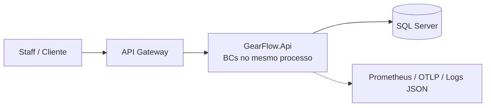

# GearFlow — Aplicação principal

Plataforma de gestão de **oficina mecânica**: clientes/veículos, catálogo de serviços, estoque de
peças/insumos e o ciclo de vida da **Ordem de Serviço** — do recebimento à entrega.

[](https://github.com/Gearflow-Fiap/gearflow-app/actions/workflows/ci.yml)
[](https://github.com/Gearflow-Fiap/gearflow-app/actions/workflows/codeql.yml)
[](docs/development/TEST_COVERAGE.md)

Este é o repositório da **aplicação principal** (repo #4 da Fase 3 do Tech Challenge), reorganizado
de Clean Architecture em camadas para **Bounded Contexts** (monólito modular), espelhando os padrões
do `delivery-app-backend`.

> **Documentação**: comece por [`docs/INDEX.md`](docs/INDEX.md). Arquitetura em
> [ADR-001](docs/architecture/adr-001-modular-monolith-bounded-contexts.md); diagramas (componentes +
> sequência) em [ARCHITECTURE_DIAGRAMS](docs/architecture/ARCHITECTURE_DIAGRAMS.md); escolha do banco
> + ER em [RFC-001](docs/rfcs/rfc-001-escolha-do-banco-de-dados.md).

## CI / Esteira

Integração contínua no GitHub Actions: build Release, testes (unit + **arquitetura** + integração via
Testcontainers), **segurança** de dependências, **CodeQL** (SAST) e **cobertura** com gate ratchet.
Em push/tag, publica as imagens `gearflow-api` e `gearflow-gateway` no **GHCR**. O **deploy**
(Terraform/K8s) fica nos repos de infra da Fase 3. Detalhes em
[docs/development/CI.md](docs/development/CI.md).

## Tecnologias

- ASP.NET Core 10 / .NET 10, EF Core 10, **SQL Server**
- MediatR (CQRS), FluentValidation, `Result<T>` → ProblemDetails (RFC 9457)
- Serilog (JSON), OpenTelemetry (Prometheus `/metrics` + OTLP), Health Checks
- YARP (API Gateway), xUnit + FluentAssertions + Testcontainers + NetArchTest

## Arquitetura (resumo)

Monólito modular: cada capacidade é um **Bounded Context** (`Domain/Application/Infrastructure`);
um único host (`GearFlow.Api`) expõe os endpoints; um Gateway fica à frente. Bounded Contexts:
**Identity, Customers, Catalog, Inventory, Workshop (core), Notifications**. Detalhe no
[ADR-001](docs/architecture/adr-001-modular-monolith-bounded-contexts.md).



## Rodando localmente

> _Scaffold em progresso — os passos abaixo refletem o alvo._

```bash
docker compose up -d            # GearFlow.Api + SQL Server + Mailpit
dotnet build GearFlow.slnx -c Release
dotnet test GearFlow.slnx       # suíte completa (integração exige Docker)
```

Portas (alvo):

| Serviço | Porta |
|---|---|
| API Gateway | 5000 |
| GearFlow.Api | 8080 (container) |
| SQL Server | 1433 |
| Mailpit (e-mail dev) | 8025 / 1025 |
| Prometheus `/metrics` | via API |

## Os 4 repositórios da Fase 3

| # | Repositório | Propósito |
|---|---|---|
| 1 | `gearflow-auth-lambda` | Function serverless: valida CPF → JWT |
| 2 | `gearflow-infra-k8s` | Terraform do cluster Kubernetes (HPA) |
| 3 | `gearflow-infra-db` | Terraform do banco gerenciado (SQL Server) |
| 4 | `gearflow-app` (**este**) | Aplicação .NET no Kubernetes |

## Status da refatoração

Ver o plano de fases em `docs/` e o [ADR-001](docs/architecture/adr-001-modular-monolith-bounded-contexts.md).
O kernel `Shared` (Domain/Infrastructure/Contracts) e a documentação base já estão no lugar; a
migração dos Bounded Contexts segue por fases preservando as regras de negócio do GearFlow original.
