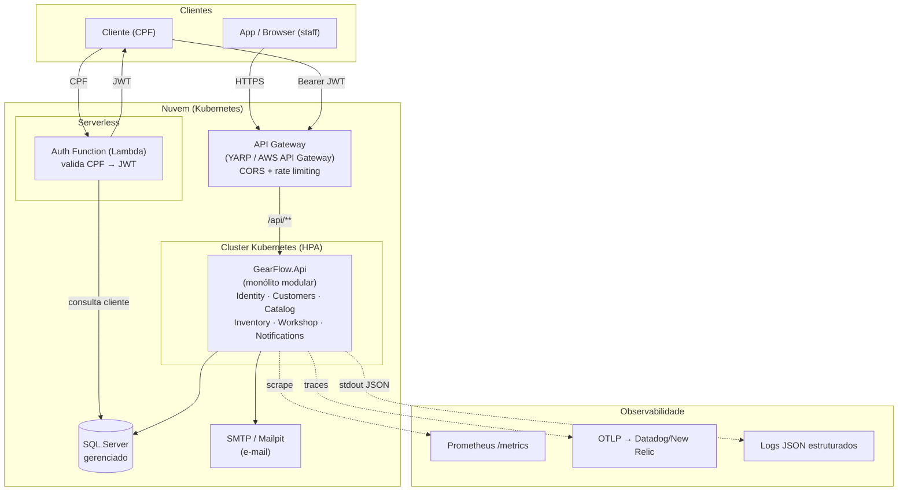
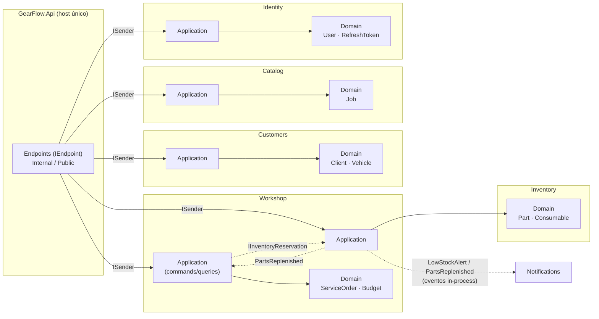
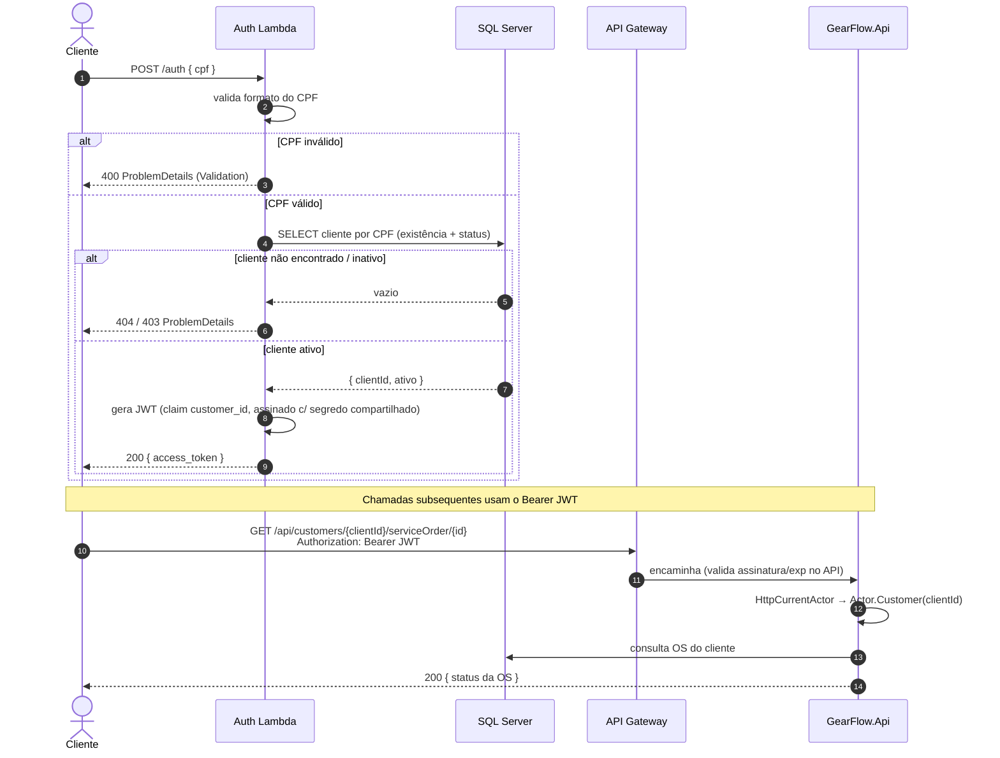
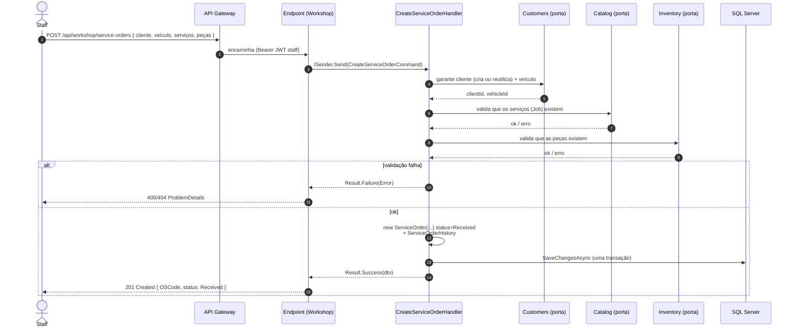
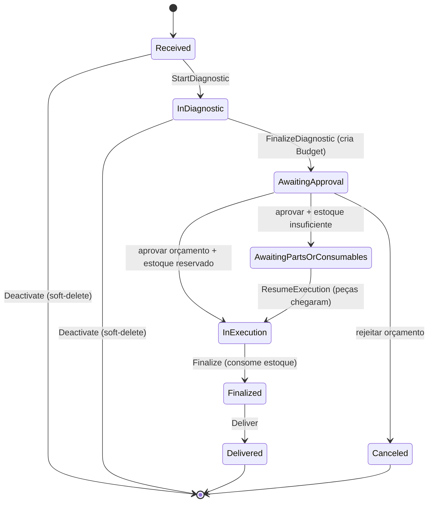

# Diagramas de arquitetura — GearFlow

Todos os diagramas em **Mermaid** (renderizam no GitHub e na maioria dos viewers de Markdown).
Atende aos itens da Fase 3: **Diagrama de Componentes** e **Diagramas de Sequência** para o fluxo de
**autenticação** e de **abertura de ordem de serviço**.

---

## 1. Diagrama de Componentes (visão de nuvem)

**Notas**
- O **API Gateway** é a entrada única; CORS e rate limiting vivem só nele.
- A **Lambda** autentica clientes por CPF (Fase 3) e assina o JWT com o **mesmo** segredo/issuer/
  audience que o `GearFlow.Api` valida — por isso a app confia no token sem chamar a Lambda.
- O `GearFlow.Api` é um **monólito modular**: todos os BCs no mesmo processo, fronteiras no código
  (ver [ADR-001](adr-001-modular-monolith-bounded-contexts.md)).

---

## 2. Componentes internos (Bounded Contexts)

Regras de dependência (travadas por testes de arquitetura): `Api → Application → Domain`,
`Infrastructure → Application → Domain`, `Domain` sem dependências externas. Cross-BC apenas por
**porta** (`IInventoryReservation`) ou **evento de integração** (`Shared.Contracts`).

---

## 3. Sequência — Autenticação por CPF (Lambda → JWT)

O login de **staff** (funcionário) é separado: e-mail/senha no Identity BC, com `SecurityStamp` que
invalida tokens ao trocar a senha. Ver [ADR-003](adr-001-modular-monolith-bounded-contexts.md)
(planejado).

---

## 4. Sequência — Abertura de Ordem de Serviço

Transições seguintes da OS (`Received → InDiagnostic → AwaitingApproval → InExecution → Finalized →
Delivered`), aprovação de orçamento e o fluxo reserva/consumo de estoque estão descritos em
[ADR-001](adr-001-modular-monolith-bounded-contexts.md) §4 e serão detalhados em ADR-002 (comunicação
cross-BC).

---

## 5. Estados da Ordem de Serviço

