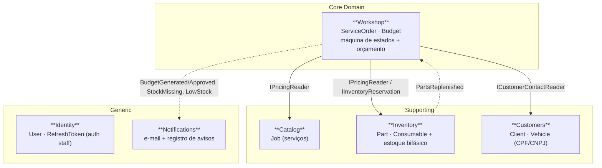

# Bounded Contexts — GearFlow

Revisão dos Bounded Contexts (BCs) do monólito modular ([ADR-001](adr-001-modular-monolith-bounded-contexts.md)):
o que cada um possui, seus agregados, endpoints e como conversam entre si
([ADR-002](adr-002-cross-bc-communication.md)).

> **Regra de dependência** (travada por testes de arquitetura): `Api → Application → Domain` e
> `Infrastructure → Application → Domain`; `Domain` sem dependências externas. **Nenhum BC referencia
> outro BC por projeto** — só por **porta** (interface de Application + SQL cru) ou **evento de
> integração** (`Shared.Contracts`).

---

## Mapa de contextos

**Core** = onde está a regra que diferencia o negócio (o ciclo da OS + orçamento). **Supporting** =
capacidades de apoio próprias do domínio. **Generic** = capacidades resolvíveis por padrão de mercado
(autenticação, notificação).

---

## Os seis contextos

### 1. Workshop — *Core Domain*
Coração do sistema: o ciclo de vida da **Ordem de Serviço** e o **Orçamento**.

- **Agregados**: `ServiceOrder` (raiz; `ServiceOrderJob`, `ServiceOrderPart`, `ServiceOrderHistory`),
  `Budget` (raiz; `BudgetJob`, `BudgetPart`, `BudgetConsumable`).
- **Regras-chave**: máquina de estados (`Received → InDiagnostic → AwaitingApproval →
  InExecution/AwaitingParts → Finalized → Delivered / Canceled`), snapshot de preço no orçamento,
  reserva-na-aprovação / consumo-na-finalização, auto-resume ao repor estoque, soft-delete.
- **Endpoints**: `Internal/ServiceOrderEndpoints` (criar, listar paginado/prioridade, detalhe,
  transições, update-vehicle, delete) · `Public/BudgetEndpoints` (aprovar/rejeitar por link + executar job).
- **Depende de** (portas): `IInventoryReservation`, `IPricingReader`, `ICustomerContactReader`.
- **Publica eventos**: `BudgetGenerated`, `BudgetApproved`, `StockMissing`, `LowStockAlert`.
- **Consome eventos**: `PartsReplenished` (auto-resume).

### 2. Inventory — *Supporting*
Estoque de **peças** e **insumos**, com controle bifásico (disponível/reservado).

- **Agregados**: `Part` (Quantity/ReservedQuantity, inteiro), `Consumable` (Quantity/ReservedQuantity, fracionário).
- **Regras-chave**: reservar (aprovação da OS), consumir (finalização), repor estoque, alerta de
  estoque mínimo.
- **Endpoints**: `Internal/PartEndpoints`, `Internal/ConsumableEndpoints` (CRUD + add-stock).
- **Serve**: implementa `IInventoryReservation` (consumida pelo Workshop) e é lida por `IPricingReader`.
- **Publica eventos**: `PartsReplenished` (ao repor).

### 3. Catalog — *Supporting*
Catálogo de **serviços** (mão de obra) oferecidos pela oficina.

- **Agregados**: `Job` (Name, Description, PriceCents).
- **Endpoints**: `Internal/JobEndpoints` (CRUD).
- **Serve**: preços de `Job` lidos por `IPricingReader` (snapshot do orçamento no Workshop).

### 4. Customers — *Supporting*
**Clientes** (PF/PJ) e seus **veículos**.

- **Agregados**: `Client` (raiz; CPF **ou** CNPJ obrigatório, `Address` como VO), `Vehicle`.
- **Regras-chave**: validação de CPF/CNPJ, unicidade de placa, um cliente N veículos.
- **Endpoints**: `Internal/ClientEndpoints` (clients CRUD + vehicles CRUD).
- **Serve**: contato do cliente lido por `ICustomerContactReader` (e-mail do orçamento).

### 5. Identity — *Generic*
Autenticação de **staff** ([ADR-003](adr-003-authentication-strategy.md)).

- **Agregados**: `User` (PasswordHash, SecurityStamp, lockout), `RefreshToken` (hash SHA-256, rotação).
- **Regras-chave**: login com lockout, refresh rotacionável, `SecurityStamp` que invalida JWTs na
  troca de senha.
- **Endpoints**: `Public/AuthEndpoints` (login, refresh-token, revoke-token, register).

### 6. Notifications — *Generic*
Avisos por **e-mail** e registro de notificações.

- **Agregados**: `Notification` (Type, Channel, Title, Message, To, DataJson).
- **Regras-chave**: reage a eventos de integração; e-mail via SMTP (Mailpit em dev).
- **Endpoints**: nenhum (só consome eventos in-process).
- **Consome eventos**: `BudgetGenerated`, `BudgetApproved`, `StockMissing`, `LowStockAlert`.

### Externals (não é BC) — borda pública
`Endpoints/Externals/Public/ExternalStatusEndpoints` — consulta pública de status da OS
(`GET /externals/{clientId}/serviceOrder/{id}`). É um **interface adapter** de leitura que orquestra
via `ISender`; não tem domínio próprio.

---

## Matriz de comunicação

| De → Para | Mecanismo | Contrato | Efeito |
|---|---|---|---|
| Workshop → Inventory | Porta (SQL cru) | `IInventoryReservation` | Reservar/consumir estoque (transacional) |
| Workshop → Inventory/Catalog | Porta (SQL cru) | `IPricingReader` | Preço p/ snapshot do orçamento |
| Workshop → Customers | Porta (SQL cru) | `ICustomerContactReader` | E-mail do cliente p/ notificação |
| Workshop → Notifications | Evento in-process | `BudgetGenerated/Approved`, `StockMissing`, `LowStockAlert` | E-mail/aviso |
| Inventory → Workshop | Evento in-process | `PartsReplenished` | Auto-resume de OS aguardando peças |

Detalhes e justificativa em [ADR-002](adr-002-cross-bc-communication.md). Sequências em
[ARCHITECTURE_DIAGRAMS.md](ARCHITECTURE_DIAGRAMS.md).

---

## Por que estas fronteiras

As fronteiras seguem a **linguagem do negócio** e a **razão de mudança**: o ciclo da OS muda por
regras de oficina (Workshop, core); estoque muda por regras de compra/consumo (Inventory); catálogo e
clientes são cadastros de apoio; autenticação e notificação são genéricos. Cada um isola um motivo de
mudança, o que mantém o núcleo (Workshop) protegido de alterações nos contextos de apoio — o
acoplamento entre eles é sempre por contrato pequeno (porta ou evento), nunca por referência de código.
