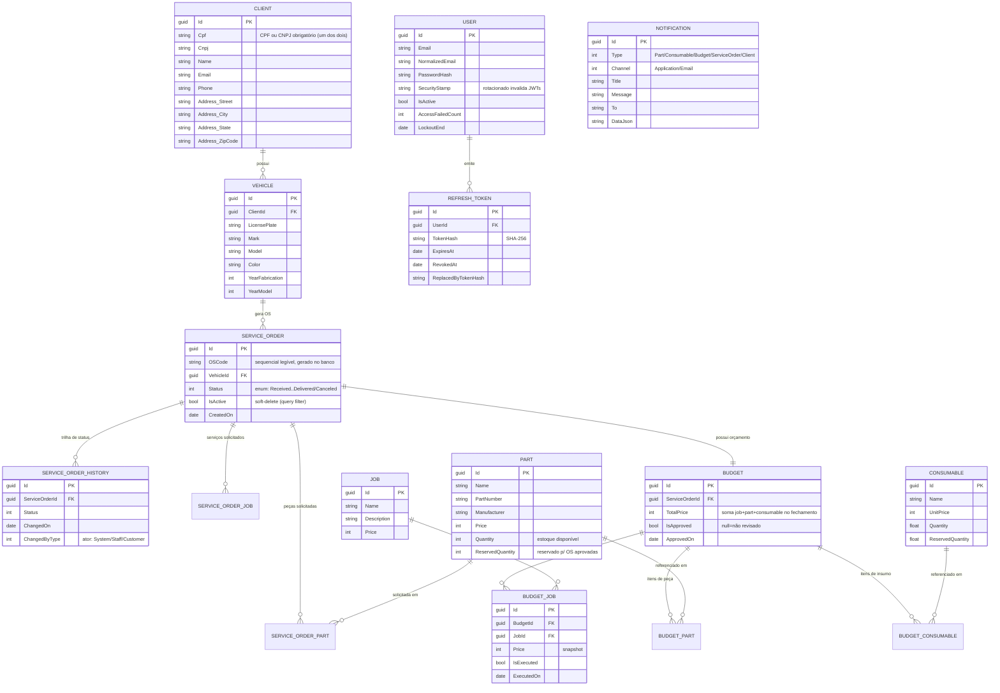

# RFC-001: Escolha do banco de dados (SQL Server gerenciado) + modelo ER

**Status**: Draft
**Author(s)**: Time GearFlow
**Date**: 2026-07-30
**Reviewers**: _(pendente)_

> Este RFC atende ao item da Fase 3: *"Justificativa formal para a escolha do banco de dados e
> ajustes no modelo relacional, com diagramas ER e explicação dos relacionamentos."*

## Summary

Mantemos **Microsoft SQL Server** como SGBD do GearFlow, agora em modo **gerenciado** na nuvem
(ex.: Amazon RDS for SQL Server ou Azure SQL Managed Instance), provisionado via Terraform (repo
`gearflow-infra-db`). A decisão preserva o esquema e as migrations EF Core existentes e evita risco
de migração de dados durante a refatoração para Bounded Contexts.

## Motivation

- O GearFlow já usa SQL Server (EF Core 10 + `Microsoft.Data.SqlClient`), com 14 migrations e uma
  query de leitura otimizada com `FOR JSON PATH` (detalhes da OS numa única ida ao banco).
- A refatoração da Fase 3 é sobre **organização** (Bounded Contexts) e **operação** (K8s,
  observabilidade), não sobre troca de tecnologia de dados. Trocar o SGBD adicionaria risco de
  migração sem benefício para os objetivos do desafio.
- A Fase 3 exige **banco gerenciado** com Terraform — o que muda é o *provisionamento/operação*, não
  o motor.

## Proposal

### Motor e modo

| Item | Decisão |
|---|---|
| SGBD | SQL Server 2022 |
| Modo | Instância **gerenciada** (RDS/Azure SQL MI), provisionada por Terraform |
| Acesso | EF Core 10 (`Microsoft.EntityFrameworkCore.SqlServer`) + Dapper (read model da OS) |
| Isolamento | Single-tenant (um banco para a operação; "múltiplas unidades" = escala de app) |
| Migrations | `DbContext.Database.MigrateAsync()` no startup (idempotente) |

### Modelo relacional (ER)

O modelo espelha os agregados dos Bounded Contexts. Valores monetários são **inteiros de centavos**
onde aplicável (evita `float`); preços em orçamento/OS são **snapshotted** (registro histórico não
muda retroativamente).

### Explicação dos relacionamentos-chave

- **Client 1—N Vehicle**: um cliente (PF por CPF ou PJ por CNPJ) tem vários veículos. Invariante: ao
  menos um de CPF/CNPJ é obrigatório.
- **Vehicle 1—N ServiceOrder**: cada OS é aberta para um veículo. `OSCode` é sequencial legível
  gerado pelo banco; `IsActive` implementa soft-delete via query filter global.
- **ServiceOrder 1—1 Budget**: o orçamento nasce ao finalizar o diagnóstico; seus itens
  (`BudgetJob/Part/Consumable`) fazem **snapshot** dos preços de `Job/Part/Consumable` no fechamento.
- **Part/Consumable — estoque bifásico**: `Quantity`/`ReservedQuantity` implementam
  reserva-na-aprovação (move de disponível para reservado) e consumo-na-finalização (baixa a reserva).
  Ver o fluxo em [ARCHITECTURE_DIAGRAMS.md](../architecture/ARCHITECTURE_DIAGRAMS.md).
- **User 1—N RefreshToken**: identidade de staff; `SecurityStamp` rotacionado (troca de senha)
  invalida JWTs em circulação.
- **ServiceOrderHistory**: trilha de mudança de status com autoria (tipo do ator), base para o
  dashboard de tempo médio por status da Fase 3.

### Índices e performance (ajustes propostos)

- Índice em `SERVICE_ORDER (Status, IsActive)` — a listagem prioriza OS ativas por status.
- Índice único em `VEHICLE (LicensePlate)` e em `CLIENT (Cpf)` / `CLIENT (Cnpj)`.
- Read model da OS (detalhes) via `FOR JSON PATH` + Dapper, evitando N+1 na composição aninhada.

## Alternatives

| Alternativa | Prós | Contras / por que não |
|---|---|---|
| **PostgreSQL gerenciado** | Alinha com o `delivery-app`; kernel Npgsql pronto; RDS barato | Exige portar 14 migrations, o `FOR JSON PATH` e revalidar todo o acesso a dados — risco alto sem ganho no escopo |
| **MySQL gerenciado** | Amplo suporte gerenciado | Mesmo custo de migração; sem vantagem sobre manter SQL Server |
| **Manter SQL Server auto-hospedado (container)** | Zero mudança | Não atende ao requisito de **banco gerenciado** da Fase 3 |

## Risks & Open Questions

- Custo do SQL Server gerenciado (licença) vs. PostgreSQL — dimensionar no `gearflow-infra-db`.
- Estratégia de backup/PITR e de rotação de credenciais (Secrets Manager) — definir no Terraform.
- Confirmar nuvem alvo (AWS RDS vs. Azure SQL MI) — será objeto do RFC-002.

## Decision

_(Pendente de review.)_ Recomendação: **aceitar** SQL Server gerenciado. Quando aceito, promover as
partes permanentes (modo gerenciado, single-tenant, migrations no startup) para um ADR.
