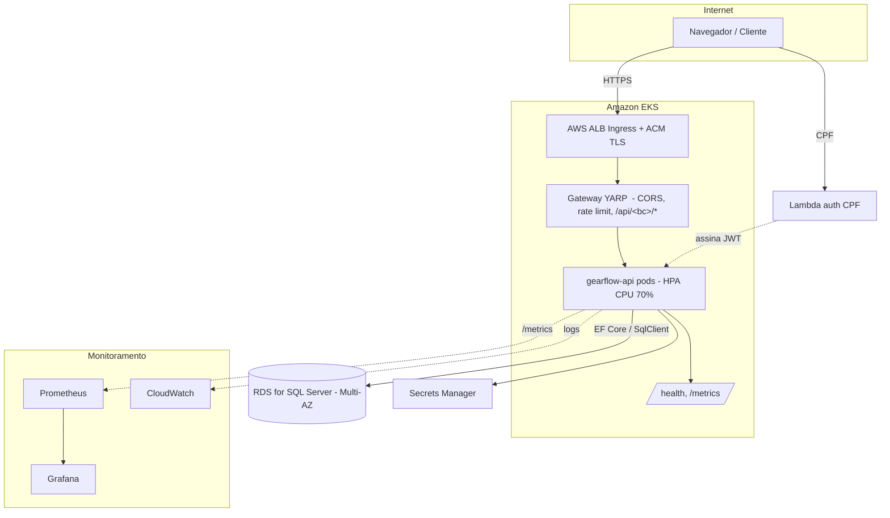

# RFC-002: Escolha da nuvem, arquitetura de implantação e API Gateway

**Status**: Draft
**Author(s)**: Time GearFlow
**Date**: 2026-07-31
**Reviewers**: _(pendente)_

> Atende ao item da Fase 3: *"Diagrama de componentes descrevendo a arquitetura em nuvem (APIs,
> banco de dados, monitoramento) e a documentação da escolha da infraestrutura de nuvem e do gateway."*

## Summary

Implantamos o GearFlow na **AWS**, em **Kubernetes gerenciado (Amazon EKS)**, com o banco em
**Amazon RDS for SQL Server** ([RFC-001](rfc-001-escolha-do-banco-de-dados.md)) e uma função
**AWS Lambda** para a autenticação por CPF ([RFC-003](rfc-003-estrategia-de-autenticacao.md)). A
entrada única é o **API Gateway YARP** (deploy próprio no cluster) atrás de um **AWS ALB (Ingress)**;
CORS, rate limiting e roteamento `/api/<bc>/*` vivem só no gateway. Toda a infra nasce de **Terraform**
(repos `gearflow-infra-k8s` e `gearflow-infra-db`).

## Motivation

- A Fase 3 exige a aplicação **em nuvem, no Kubernetes, com alta disponibilidade, escalabilidade
  (HPA — [ADR-004](../architecture/adr-004-kubernetes-scalability-hpa.md)), IaC (Terraform) e
  monitoramento**.
- Precisamos de uma **entrada única** com CORS/rate limiting centralizados, para não espalhar essa
  responsabilidade pelos BCs (ADR-001).
- A escolha deve ser coerente com o banco gerenciado (RFC-001) e com a função serverless de CPF
  pedida pela Fase 3.

## Proposal

### Nuvem: AWS

| Componente | Serviço AWS | Papel |
|---|---|---|
| Orquestração | **EKS** (Kubernetes gerenciado) | Roda `gearflow-api` + `gateway`, com HPA |
| Entrada externa | **ALB** via AWS Load Balancer Controller (Ingress) | TLS (ACM), encaminha ao gateway |
| Banco | **RDS for SQL Server** | Dados (RFC-001), Multi-AZ para HA |
| Auth CPF | **Lambda** + API Gateway/Function URL | Valida CPF, assina JWT (RFC-003) |
| Segredos | **Secrets Manager** | `Jwt:Secret`, connection string, SMTP |
| Imagens | **ECR** | Imagens Docker da API e do gateway |
| Observabilidade | **CloudWatch** + Prometheus/Grafana no cluster | Logs, métricas, dashboards |

**Why AWS**: EKS + RDS + Lambda + ALB cobrem exatamente os requisitos (K8s gerenciado, banco
gerenciado, serverless para CPF, LB gerenciado) com um único provedor e um único Terraform.

### Topologia de implantação

### API Gateway (YARP)

- **Entrada única** na porta 5000; rotas **config-driven**: `/api/<bc>/{**}` → BC correspondente
  (com `PathRemovePrefix`), `/health` e `/metrics` isentos de rate limit.
- **CORS vive só aqui** — nenhum BC declara CORS (ADR-001).
- **Rate limiting só aqui** — janela apertada em `/login`/`/auth`, política global generosa no resto.
- No monólito atual o gateway e a API são dois deploys no mesmo cluster; ao extrair BCs, o mesmo
  gateway passa a rotear para múltiplos serviços sem mudar o contrato `/api/<bc>/*`.

**Why YARP e não o ALB puro**: o ALB resolve TLS e L7 externo, mas CORS/rate limiting/roteamento por
BC com reescrita de path são responsabilidade de aplicação — o YARP as centraliza de forma versionada
no repositório, e acompanha a aplicação em qualquer nuvem.

### IaC e monitoramento

- **Terraform** provisiona VPC, EKS, node groups, RDS, ALB Controller, IRSA, ECR, Secrets Manager
  (`gearflow-infra-k8s`) e o banco (`gearflow-infra-db`).
- **Monitoramento**: `/metrics` (Prometheus) e logs estruturados (Serilog JSON → CloudWatch);
  dashboards no Grafana; health checks (`/health/live`, `/health/ready`) usados por probes e HPA
  ([OBSERVABILITY.md](../architecture/OBSERVABILITY.md)).

## Alternatives

| Alternativa | Prós | Contras / por que não |
|---|---|---|
| **Azure (AKS + Azure SQL MI + Functions + App Gateway)** | Casa com SQL Server nativamente | Sem ganho decisivo; a equipe padroniza tooling AWS; RDS SQL Server atende |
| **ECS/Fargate em vez de EKS** | Menos operação que K8s | A Fase 3 pede **Kubernetes** explicitamente |
| **Só ALB, sem YARP** | Um componente a menos | CORS/rate limit/rewrite por BC viram config de infra, menos portável e versionável |
| **API Gateway gerenciado (AWS APIGW) na frente** | Rate limit gerenciado | Duplicaria o papel do YARP; YARP já cobre e viaja com a app |

## Risks & Open Questions

- Custo do EKS + RDS SQL Server (licença) — dimensionar node groups e classe do RDS no Terraform.
- `maxReplicas` do HPA vs. limite de conexões do RDS (ADR-004) — casar pool e réplicas.
- Estratégia de TLS/DNS (ACM + Route 53) e de secrets rotation — detalhar no `gearflow-infra-k8s`.

## Decision

_(Pendente de review.)_ Recomendação: **aceitar** AWS (EKS + RDS + Lambda + ALB) com gateway YARP.
As partes permanentes (entrada única, CORS/rate limit só no gateway) já estão em
[ADR-001](../architecture/adr-001-modular-monolith-bounded-contexts.md); HPA em
[ADR-004](../architecture/adr-004-kubernetes-scalability-hpa.md).
