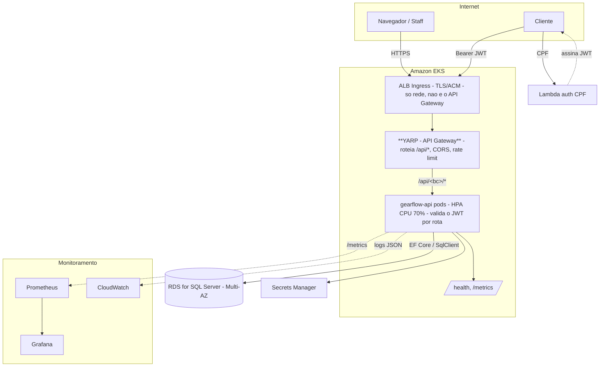

# RFC-002: Escolha da nuvem, arquitetura de implantação e API Gateway

**Status**: Accepted
**Author(s)**: Time GearFlow
**Date**: 2026-07-31
**Reviewers**: _(pendente)_

> Atende ao item da Fase 3: *"Diagrama de componentes descrevendo a arquitetura em nuvem (APIs,
> banco de dados, monitoramento) e a documentação da escolha da infraestrutura de nuvem e do gateway."*

## Summary

Implantamos o GearFlow na **AWS**, em **Kubernetes gerenciado (Amazon EKS)**, com o banco em
**Amazon RDS for SQL Server** ([RFC-001](rfc-001-escolha-do-banco-de-dados.md)) e uma função
**AWS Lambda** para a autenticação por CPF ([RFC-003](rfc-003-estrategia-de-autenticacao.md)).

**O API Gateway do projeto é o YARP** (`src/Gateway`), rodando **dentro do cluster** como entrada
única: roteamento `/api/<bc>/*`, CORS e rate limiting. **Não usamos um API Gateway gerenciado da
nuvem** (AWS API Gateway/Kong/Traefik) — o requisito permite explicitamente *"ou outro"*, e o YARP já
cumpre esse papel, é portável e evita um serviço gerenciado a mais.

## Motivation

- A Fase 3 exige a aplicação **em nuvem, no Kubernetes**, com alta disponibilidade, escalabilidade
  (HPA — [ADR-004](../architecture/adr-004-kubernetes-scalability-hpa.md)), IaC (Terraform),
  monitoramento **e um API Gateway** para *"controle e roteamento"*.
- Precisamos de uma **entrada única** com CORS/rate limiting centralizados, para não espalhar essa
  responsabilidade pelos BCs ([ADR-001](../architecture/adr-001-modular-monolith-bounded-contexts.md)).
- A escolha deve ser coerente com o banco gerenciado (RFC-001) e com a função serverless de CPF.

## Proposal

### ⚠️ API Gateway ≠ Load Balancer (a distinção que causa confusão)

São **dois componentes diferentes** e ambos existem na topologia:

| Componente | O que é | Papel | É "o API Gateway" do requisito? |
|---|---|---|---|
| **ALB / Ingress** | Load balancer L7 gerenciado (AWS) | Entrada de **rede** no cluster: TLS (ACM), balanceia entre os pods | **Não** — é infraestrutura de rede |
| **YARP Gateway** | App .NET (`src/Gateway`) no cluster | **Roteia** `/api/<bc>/*`, **CORS**, **rate limiting** | **Sim** — este é o API Gateway |

O ALB só *coloca o tráfego pra dentro do cluster*. Quem faz o papel de **API Gateway** (roteamento +
controle) é o **YARP**. Não há AWS API Gateway na topologia.

### Nuvem: AWS

| Componente | Serviço AWS | Papel |
|---|---|---|
| Orquestração | **EKS** (Kubernetes gerenciado) | Roda `gearflow-api` + `gateway` (YARP), com HPA |
| Entrada de rede | **ALB** via AWS Load Balancer Controller (Ingress) | TLS (ACM), encaminha ao YARP |
| **API Gateway** | **YARP** (deploy no cluster) | Roteamento `/api/<bc>/*`, CORS, rate limiting |
| Banco | **RDS for SQL Server** | Dados (RFC-001), Multi-AZ para HA |
| Auth CPF | **Lambda** + Function URL | Valida CPF, assina JWT (RFC-003) |
| Segredos | **Secrets Manager** | `Jwt:Secret`, connection string, SMTP |
| Imagens | **ECR** | Imagens Docker da API e do gateway |
| Observabilidade | **CloudWatch** + Prometheus/Grafana no cluster | Logs, métricas, dashboards |

**Why AWS**: EKS + RDS + Lambda + ALB cobrem os requisitos (K8s gerenciado, banco gerenciado,
serverless para CPF, LB gerenciado) com um único provedor e um único Terraform.

### Topologia de implantação

### API Gateway (YARP) — o que faz e o que não faz

**Faz** (hoje, em `src/Gateway/Program.cs`):
- **Entrada única** na porta 5000; rotas **config-driven** (`appsettings.json`): `/api/{**}` e
  `/health/{**}` → `gearflow-api`. Adicionar um BC é editar config, não código.
- **CORS** — vive **só aqui** (nenhum BC declara CORS — ADR-001).
- **Rate limiting** — vive **só aqui**: janela apertada em `/auth`/`/login` (10/min por IP), generosa
  no resto (100/10s); `/health` e `/metrics` isentos.

**Não faz** (por decisão): a **validação do JWT** acontece **na aplicação** (`GearFlow.Api`), por
rota (`RequireAuthorization()` nas sensíveis). O gateway roteia; a app autentica/autoriza. As rotas
sensíveis exigem o JWT emitido pela Lambda de CPF — é assim que *"proteger rotas sensíveis com
autenticação via CPF"* é cumprido ([RFC-003](rfc-003-estrategia-de-autenticacao.md)).

> **Endurecimento opcional (futuro)**: mover a validação do JWT para o próprio YARP (rejeitar no
> gateway antes de encostar na app) é possível sem mudar a Lambda nem os BCs — hoje ficou na app por
> simplicidade e porque a app precisa do ator autenticado de qualquer forma (defesa em profundidade).

### IaC e monitoramento

- **Terraform** provisiona VPC, EKS, node groups, RDS, ALB Controller, IRSA, ECR, Secrets Manager
  (`gearflow-infra-k8s`) e o banco (`gearflow-infra-db`). **O deploy do YARP** (Deployment/Service)
  vive nos manifests do cluster (repo da app e/ou `gearflow-infra-k8s`).
- **Monitoramento**: `/metrics` (Prometheus) e logs estruturados (Serilog JSON → CloudWatch);
  dashboards no Grafana; health checks (`/health/live`, `/health/ready`) usados por probes e HPA
  ([OBSERVABILITY.md](../architecture/OBSERVABILITY.md)).

## Alternatives

| Alternativa | Prós | Contras / por que não |
|---|---|---|
| **AWS API Gateway gerenciado** + Lambda Authorizer | Integra a Lambda nativamente; narrativa serverless "clássica"; rate limit gerenciado | Sobrepõe o papel do YARP (que já temos e funciona); adiciona IaC (VPC Link/IAM p/ alcançar o EKS) e um serviço gerenciado a mais. **Escolhemos YARP** por já estar pronto, portável e com menos infra |
| **Kong / Traefik** (gateway OSS no cluster) | Mais features de gateway (plugins de auth, etc.) | Uma peça nova para operar; o YARP já cobre roteamento/CORS/rate limit do nosso escopo |
| **Só ALB, sem gateway de app** | Um componente a menos | CORS/rate limit/rewrite por BC viram config de infra — menos versionável e portável |
| **Azure (AKS + Azure SQL MI + App Gateway)** | Casa com SQL Server nativamente | Sem ganho decisivo; a equipe padroniza AWS; RDS SQL Server atende |
| **ECS/Fargate em vez de EKS** | Menos operação que K8s | A Fase 3 pede **Kubernetes** explicitamente |

## Risks & Open Questions

- Custo do EKS + RDS SQL Server (licença) — dimensionar node groups e classe do RDS no Terraform.
- `maxReplicas` do HPA vs. limite de conexões do RDS (ADR-004) — casar pool e réplicas.
- Estratégia de TLS/DNS (ACM + Route 53) e de secrets rotation — detalhar no `gearflow-infra-k8s`.
- Se um grader esperar o JWT rejeitado **no gateway**, avaliar o "endurecimento opcional" acima.

## Decision

**Aceito.** Nuvem **AWS** (EKS + RDS + Lambda + ALB); o **API Gateway é o YARP** (`src/Gateway`),
in-cluster, dono de roteamento/CORS/rate limiting; o **ALB é apenas ingress de rede** (TLS/LB), não o
API Gateway. Partes permanentes já em [ADR-001](../architecture/adr-001-modular-monolith-bounded-contexts.md)
(entrada única, CORS/rate limit só no gateway) e [ADR-004](../architecture/adr-004-kubernetes-scalability-hpa.md) (HPA).
