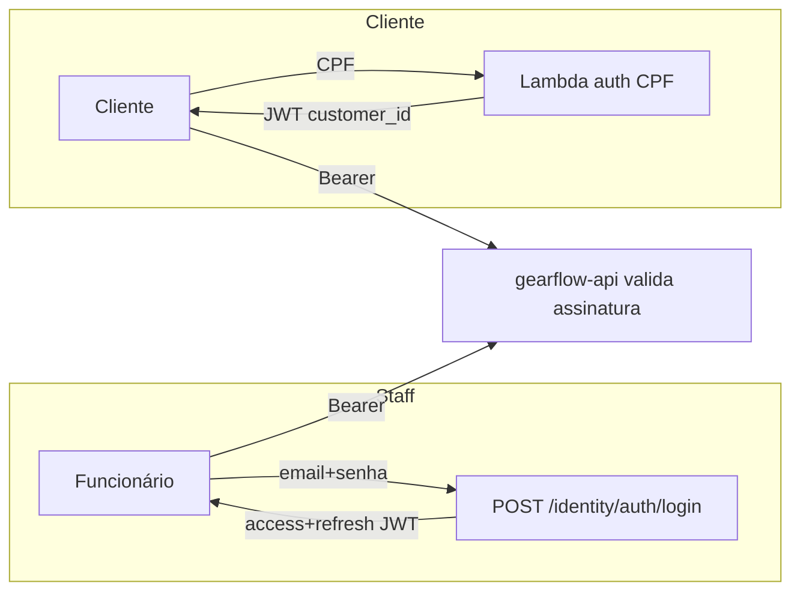

# RFC-003: Estratégia de autenticação (staff JWT + CPF serverless)

**Status**: Draft
**Author(s)**: Time GearFlow
**Date**: 2026-07-31
**Reviewers**: _(pendente)_

> Atende ao item da Fase 3: *"Documentação da estratégia de autenticação"*, incluindo a **função
> serverless** que autentica o cliente por CPF.

## Summary

Duas portas de entrada, **uma única credencial**: **JWT Bearer** (HMAC-SHA256). Staff faz login por
e-mail/senha no BC **Identity** (access + refresh token, com `security_stamp` revogável). Cliente
autentica por **CPF** numa **função AWS Lambda** (`gearflow-auth-lambda`) que assina um JWT com o
**mesmo segredo/issuer/audience** que a API valida. A API **valida** tokens, nunca chama a Lambda.
Fluxos de aprovar orçamento e consulta de status são **anônimos por design**. A decisão permanente
está no [ADR-003](../architecture/adr-003-authentication-strategy.md).

## Motivation

- A Fase 3 pede explicitamente uma **função serverless para autenticar o cliente por CPF** e a
  **documentação da estratégia de autenticação**.
- O legado só distinguia autenticado vs. anônimo (sem papéis). Queremos preservar isso, mas com uma
  credencial stateless que permita **escala horizontal** (HPA — [ADR-004](../architecture/adr-004-kubernetes-scalability-hpa.md))
  e **revogação real** de sessão de staff.

## Proposal

### Visão geral

### 1. Staff — Identity BC (login + refresh)

- Senha via `PasswordHasher` (ASP.NET Core Identity); **lockout** por tentativas.
- Emite **access token** (curto) + **refresh token** (hash SHA-256 persistido, rotacionável, com IP).
- Claims: `sub`, `email`, `unique_name`, `jti`, **`security_stamp`**.
- **`security_stamp`** rotaciona na troca de senha → revalidado a cada request
  (`AddStaffSecurityStampValidation` no `OnTokenValidated`) → **invalida JWTs antigos** sem sessão
  server-side.
- Endpoints: `POST /identity/auth/login`, `/refresh-token`, `/revoke-token`, `/register`.

### 2. Cliente — Lambda de CPF (serverless)

- `gearflow-auth-lambda` recebe o **CPF**, valida o dígito verificador e consulta o cliente
  (existência/ativo).
- Se válido, **assina um JWT** com claim `customer_id`, usando `secret`/`issuer`/`audience`
  compartilhados com a API.
- A API só **valida** o token (mesma pipeline JWT de staff); o ator vira `Actor.Customer` via
  `ICurrentActor`.
- **Por que Lambda**: a Fase 3 pede serverless; isola a regra de CPF, escala sozinha e mantém o CPF
  fora do caminho quente da API.

### 3. Fluxos anônimos (sem papéis)

Como no legado, autorização é **autenticado vs. anônimo** — sem RBAC:
- `GET/PUT /workshop/budgets/{id}/approve|reject` — link do e-mail; o "segredo" é o id do orçamento.
- `GET /externals/{clientId}/serviceOrder/{id}` — consulta pública de status.

### Validação centralizada

`Shared.Infrastructure/Auth/JwtAuthenticationExtensions` valida assinatura, issuer, audience e
expiração. `JwtOptions` (seção `Jwt`) validado no boot (`ValidateOnStart`). CORS/rate limiting no
gateway ([RFC-002](rfc-002-nuvem-e-api-gateway.md)).

## Alternatives

| Alternativa | Prós | Contras / por que não |
|---|---|---|
| **JWKS (chave assimétrica RS256)** | Lambda assina com chave privada; API só precisa da pública; rotação isolada | Mais peças (par de chaves, endpoint JWKS); HMAC é suficiente no escopo — **candidato natural de evolução** |
| **CPF autenticado dentro da API** (sem Lambda) | Um componente a menos | A Fase 3 pede serverless; e isolar CPF dá escala/segurança independentes |
| **Sessão server-side (cookie)** | Simples de invalidar | Estado compartilhado atrapalha HPA; JWT + security_stamp cobre revogação |
| **RBAC com papéis** | Autorização fina | O legado não tinha e não há requisito — complexidade sem valor |

## Risks & Open Questions

- **Segredo HMAC compartilhado** entre Lambda e API: rotação exige coordenar os dois — mitigável
  migrando para JWKS (assimétrico) sem mudar consumidores.
- Posse `clientId`↔OS no Externals é hoje "por conhecimento do id" — avaliar validar a posse
  (TODO documentado no ADR-003).
- Tempo de vida do access token vs. UX de refresh — afinar no piloto.

## Decision

_(Pendente de review.)_ Recomendação: **aceitar** staff JWT (Identity) + CPF via Lambda com segredo
compartilhado, fluxos anônimos por design. Partes permanentes promovidas ao
[ADR-003](../architecture/adr-003-authentication-strategy.md).
